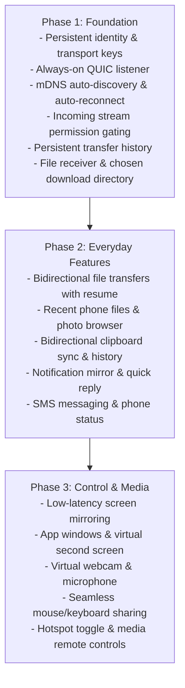

<!-- SPDX-FileCopyrightText: Contributors to the Continue project -->
<!-- SPDX-License-Identifier: Apache-2.0 -->

# Continue feature roadmap

## Overview

Continue connects your phone and your computer so you can move files, text, notifications and your attention between them without thinking about which device you are on. This plan takes it from a working pairing-and-send core to a complete phone companion, and adds features no other companion app has.

Four principles decide every feature below:

- **Local first.** Devices talk directly over your own network. Nothing passes through a server, and nothing works less well because of it.
- **No account.** Pairing a phone is scanning one code. There is no sign-in, no cloud profile and no telemetry.
- **Private by default.** Every capability is off until you allow it per device, and you can see what each device did.
- **Open source.** Anyone can read how it works, audit the security and build it themselves.

Continue ships as a desktop app (Windows, macOS, Linux) and an Android app, sharing one Rust core for security, networking and the protocol.

## Where Continue is today

Phase 1 is done apart from device names: paired devices stay paired across restarts, find and reconnect to each other on their own, and send files and text both ways. Keys are kept in a file in the app's data folder, not yet in the platform's secret store.

| Area | Works today | Missing |
| --- | --- | --- |
| Pairing | QR code or pasted code; signed, pinned and replay-protected | Nothing blocking |
| Identity | Device keys are saved and reused, so pairing survives restarts | Keys live in a file in the app's data folder, not the platform's secret store |
| Connecting | Each device listens for paired devices, finds them over mDNS and reconnects after a restart or dropped network | Nothing blocking |
| Device names | Pairing works without them | Names aren't exchanged, so each side shows a placeholder for the other |
| Files | Both ways, with progress, cancel, a chosen save folder and open-when-done | Resuming after a dropped connection |
| Text | Clipboard sync both ways, automatic or manual | Images and clipboard history |
| Notifications | Protocol and permission exist | The phone doesn't forward its notifications yet |
| Permissions | Allow, Ask or Block per device, checked on every incoming file and text | Nothing blocking |
| History | Everything sent and received, saved across restarts, with a clear button | Nothing blocking |

The protocol runs over QUIC with TLS 1.3. Each device has an Ed25519 identity key and a separate transport key, and peers pin each other's transport key after pairing.

## Phase 1: Foundation

Phase 1 makes a paired phone stay paired, find the computer on its own and talk in both directions. Every later feature depends on it.

1. **Keys that survive a restart.** Save the identity seed and the transport key in the platform's secret store (Keychain, Windows DPAPI, Secret Service on Linux, Android Keystore), with a permission-restricted file as the fallback. Pairing then lasts until you unpair.
2. **Always listening.** Each device keeps one QUIC listener open that only accepts peers it has paired with, checked by their pinned transport key. Either side can start a session, and a simple rule (lower fingerprint dials) stops both from connecting at once.
3. **Finding each other.** Advertise over mDNS with a rotating random ID, so the network never sees a stable device identifier. A paired device proves itself during the pinned TLS handshake, so nobody types an IP address.
4. **Reconnecting.** Reconnect with backoff when Wi-Fi drops, the laptop wakes from sleep or the phone changes networks.
5. **Real device names.** Use the computer's name and the phone's model and owner-set name instead of placeholders.
6. **Permission checks on incoming streams.** Every incoming file, clipboard or notification stream is checked against the per-device grant before anything is written or shown. Ask pops a prompt; Block refuses.
7. **Saved history.** Everything sent and received is stored locally, with a limit and a clear button.
8. **Received files.** Save to a folder you choose (Downloads by default), with progress, cancel and open-when-done.

**Done when:** you pair once, restart both devices, and the phone reconnects by itself and can send a file to the computer.

## Phase 2: Everyday features

Phase 2 covers what people do dozens of times a day: move files, copy and paste across devices, and keep up with the phone without picking it up.

| Feature | What you get | Notes |
| --- | --- | --- |
| Files both ways | Drop on either device, pick from a share sheet on the phone, see progress, resume after a dropped connection | Resume needs a start offset added to the transfer protocol |
| Recent files | Photos, screenshots and downloads from the phone listed on the computer, grouped by type (documents, images, video, audio, archives, apps) | Pulled on request; nothing is copied until you open it |
| Clipboard sync | Copy on one device, paste on the other; text, links and images | Automatic or manual per device; passwords from password managers are skipped |
| Clipboard history | A searchable list of recent clips from both devices, with pinning | Stored only on your devices; clears on a timer you set |
| Notifications | Phone notifications on the computer, grouped by app, with dismiss synced back | Per-app filter; nothing from apps you mute |
| Quick reply | Reply from the computer to notifications that support it | Uses the notification's own reply action, no extra permission |
| Messages | Read and send SMS from the computer, with contacts and threads | Needs SMS and contacts permission on the phone; opt-in |
| Calls | See who is calling, answer or decline, send a quick text instead | Audio stays on the phone in this phase |
| Photos | Browse the phone's photos by date and album, drag any of them out | Thumbnails stream on demand; full size on drag |
| Search | One search box across phone files, photos, messages and contacts | Runs on the phone; only results travel |
| Phone status | Battery, charging, signal and Wi-Fi shown on the computer | Low-battery alert once |

## Phase 3: Control and media

Phase 3 lets the computer drive the phone and use its hardware. These are the largest pieces of work and each ships on its own.

| Feature | What you get | Main work |
| --- | --- | --- |
| Screen mirroring | The phone's screen in a window on the computer, controlled with mouse and keyboard | Android MediaProjection capture, H.264 hardware encode, low-latency stream over QUIC, input injection through an accessibility service |
| Phone as second screen | Use a tablet or phone as an extra display for the computer | Virtual display driver on each desktop OS; the hardest item in the plan |
| Phone as webcam | The phone's camera shows up as a camera in any video-call app | Camera2 capture on the phone, a virtual camera on the computer (v4l2loopback on Linux, a DirectShow/Media Foundation source on Windows, a CoreMediaIO extension on macOS) |
| Phone as microphone | The phone's mic as an input device | Virtual audio device per OS |
| Shared mouse and keyboard | Move the pointer off the edge of the computer screen onto a tablet or phone and type there | Input capture on the desktop, injection through an accessibility service on the phone |
| App windows | Open a single phone app in its own window on the computer | Built on mirroring with a per-app virtual display (Android 10+) |
| Hotspot | Turn on the phone's hotspot from the computer and join it in one click | Android limits hotspot control for third-party apps; may need the system settings panel as a fallback |
| Media control | Play, pause, skip and volume for what is playing on the phone | Media session API; small and can ship early |

## Only in Continue

These features set Continue apart. Most follow from the product's name: pick up on one device exactly where you stopped on the other.

### Continue where you left off

- **Handoff.** The page, document, video position or map route open on the phone appears as a one-click card on the computer, and the other way round. Links open at the same scroll position; videos resume at the same second.
- **Copy here, paste there, even later.** A clip copied on the phone while the laptop is asleep is waiting when it wakes, instead of being lost.
- **Send later.** Queue files and text for a device that is offline; they deliver themselves the next time it is nearby, with a badge showing what is waiting.

### Trust you can see

- **Activity log per device.** A plain list of everything each device sent, received or accessed, with times.
- **One-tap lockdown.** Pause every capability for every device at once, for example on public Wi-Fi, and resume later.
- **Verify by words.** Besides the QR code, pairing can be confirmed by comparing four short words on both screens, for people who cannot scan.
- **Auditable builds.** Reproducible builds, so anyone can check the app matches the source.

### Small things that save time

- **Find my phone.** Ring the phone at full volume from the computer, even on silent.
- **Proximity lock.** Lock the computer when the phone leaves the room, and optionally unlock it when you come back and the phone is unlocked.
- **Scan to computer.** Point the phone camera at a page; a cropped, straightened PDF lands in the computer's folder.
- **Drop folder.** A folder on the computer whose contents appear on the phone automatically, and the reverse, with no cloud in between.
- **Snippets.** Pinned clips (addresses, account numbers, replies) available on every paired device.
- **Text from phone to any field.** Dictate or type on the phone and the words land in whatever text box is focused on the computer.
- **Several phones, one computer.** Every device in the sidebar at once, each with its own permissions, instead of one phone at a time.

## Technical notes

Each feature becomes a protocol capability with its own ID, permission and stream type, so it can be allowed or blocked per device.

| Capability | Android needs | Desktop needs |
| --- | --- | --- |
| Files, recent files, photos | Photo picker; media read permission for browsing | Chosen save folder |
| Clipboard sync | Foreground only on Android 10+ unless the keyboard or accessibility route is enabled | Clipboard watcher per OS |
| Notifications, quick reply | Notification listener access | Native notifications (toast, Notification Center, libnotify) |
| Messages, calls | SMS, contacts and phone state permissions; Play policy review | None |
| Search | Local index on the phone | None |
| Screen mirroring, app windows | MediaProjection consent each session; accessibility service for input | Hardware video decode |
| Webcam, microphone | Camera and microphone permissions, foreground service | Virtual camera and audio device per OS |
| Shared mouse and keyboard | Accessibility service | Input capture permission (accessibility on macOS) |
| Hotspot | Limited for third-party apps | Wi-Fi join per OS |
| Find my phone, proximity lock | Full-screen alert permission; Bluetooth LE for distance | Screen-lock API per OS |
| Handoff | Share target plus an optional browser extension for tab position | Browser extension or open-URL handler |

- **Transport.** Large media (mirroring, webcam) uses QUIC datagrams or unreliable streams to avoid head-of-line delays. Control and files keep reliable streams.
- **Background running.** The phone keeps the session alive in a foreground service with a quiet, persistent notification, as Android requires.
- **Core in Rust.** Protocol, crypto, discovery, transfer and permissions live in shared Rust crates. Only OS integrations are written per platform, in Kotlin and in the desktop app's backend.
- **Security.** Every new capability goes through the existing permission store and pinned TLS session. No feature opens a second network path.

## Design and settings

The desktop app keeps its sidebar layout: pages at the top, paired devices below, so switching phones is one click. New features appear as pages or device tabs only once they work, never as greyed-out placeholders.

**Desktop pages**

- **Home:** the selected device with status and battery, a drop area, a text box, and handoff cards for what you were just doing on the phone.
- **Files:** sent and received files, recent phone files by type, the photo browser and the drop folder.
- **Clipboard:** clipboard history and snippets from all devices.
- **Messages:** conversations, and calls when enabled.
- **Screen:** mirroring, app windows, second screen, webcam and microphone, each started from here.
- **History:** the activity log, filterable by device and type.

**Settings**

| Section | What it holds |
| --- | --- |
| General | Computer name, start at login, theme, accent colour |
| Devices | Each device's permissions per capability, reconnect behaviour, unpair |
| Files | Save folder, ask before saving, drop folder location |
| Clipboard | Automatic sync on or off, history length, clear history |
| Notifications | Which phone apps may show here, quiet hours |
| Privacy | Lockdown switch, activity log retention, proximity lock |
| About | Version, security code, open-source licences |

**Phone app:** one screen per paired computer with the same capabilities and permissions, a share-sheet target (Send to computer), a quick-settings tile for find-my-computer and lockdown, and a persistent notification while connected.

## Order of work

The phases run in order because each one depends on the last, and the features unique to Continue come before the heavy media work so the app is worth using sooner.

Phase 3 features that are small (find my phone, send later, activity log) can ship alongside Phase 2 once the foundation is in.

**Risks**

- **Android background limits.** Clipboard access and long-running sessions are restricted; the foreground service and permission prompts must be explained clearly or people will turn them off.
- **Play Store policy.** SMS, call log and accessibility permissions need a declared, reviewed use. A separate build outside the Play Store may be needed for the full feature set.
- **Virtual devices.** Webcam, microphone and second screen need a driver or extension per desktop OS, each with its own signing and install steps.
- **Network variety.** Guest and corporate Wi-Fi often block device-to-device traffic. A fallback such as USB or Wi-Fi Direct is worth planning early.

**Open questions**

- [ ] Is an iPhone app in scope? iOS restricts clipboard, notifications, messages and screen capture far more than Android.
- [ ] Ship on the Play Store, outside it, or both?
- [ ] Should handoff include a browser extension in the first version, or links only?
